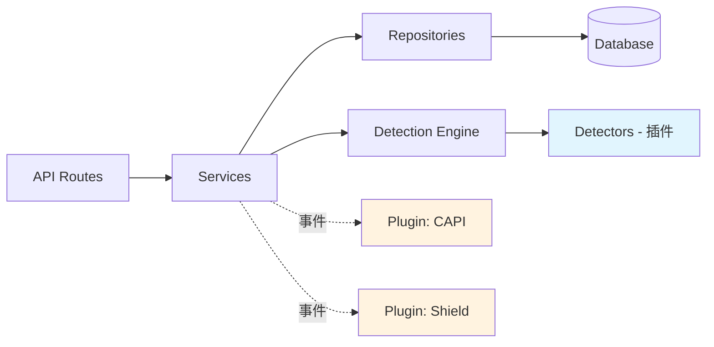

# 🛡️ 斗篷(Cloak)系统 — 工程准则与架构设计规范

> 本文档定义了本项目的核心工程原则、设计模式和编码规范。
> 所有开发决策必须遵守这些准则，确保系统**低耦合、高内聚、易扩展**。

---

## 一、核心设计哲学

### 1.1 牵一发不能动全身

**每个模块都是一个独立的"积木块"**，可以单独添加、替换、移除，而不影响其他模块。

```
❌ 错误做法：
  添加一个新的检测规则 → 需要修改 5 个文件 → 产生 3 个 bug

✅ 正确做法：
  添加一个新的检测规则 → 只新建 1 个文件 → 注册到Pipeline → 自动生效
```

### 1.2 开闭原则 (Open/Closed Principle)

**对扩展开放，对修改关闭。**

- 新增功能 = 新增文件/模块
- 不修改已有稳定代码
- 通过接口/契约/注册机制来扩展

### 1.3 单一职责原则 (Single Responsibility)

**每个模块/文件/函数只做一件事。**

| 模块 | 职责 | 不该做的事 |
|------|------|-----------|
| IPDetector | 判断IP是否为Bot | 不应该处理跳转逻辑 |
| DecisionEngine | 汇总各检测器结果做最终判定 | 不应该直接查数据库 |
| CampaignService | 管理活动CRUD | 不应该包含检测逻辑 |

---

## 二、架构模式

### 2.1 插件式检测管道 (Detection Pipeline Pattern)

**这是系统最核心的架构决策。**

所有检测器(Detector)都实现统一接口，通过管道(Pipeline)串联执行。新增检测维度只需：
1. 创建新 Detector 文件
2. 实现标准接口
3. 在 Pipeline 注册

```javascript
// 每个检测器必须实现的接口
class BaseDetector {
  /**
   * @param {RequestContext} ctx - 请求上下文
   * @returns {DetectionResult} - { isBot: boolean, confidence: number, reason: string }
   */
  async detect(ctx) {
    throw new Error('Must implement detect()');
  }

  /** 检测器名称，用于日志和调试 */
  get name() {
    throw new Error('Must implement name getter');
  }
}
```

```javascript
// Pipeline 自动编排所有已注册的检测器
class DetectionPipeline {
  constructor() {
    this.detectors = [];
  }

  // 注册新检测器 — 扩展点
  register(detector) {
    this.detectors.push(detector);
  }

  // 执行所有检测器，汇总结果
  async execute(ctx) {
    const results = await Promise.all(
      this.detectors.map(d => d.detect(ctx))
    );
    return results;
  }
}
```

**好处**：未来要添加"鼠标行为分析检测器"？只需新建一个文件，注册即可。零修改旧代码。

### 2.2 分层架构 (Layered Architecture)

```
┌─────────────────────────────────────┐
│         表现层 (React SPA)           │  ← 纯UI，只调API
├─────────────────────────────────────┤
│         API路由层 (Routes)           │  ← 参数校验，调用Service
├─────────────────────────────────────┤
│         业务逻辑层 (Services)         │  ← 核心业务，不依赖框架
├─────────────────────────────────────┤
│         数据访问层 (Repositories)     │  ← 数据库操作封装
├─────────────────────────────────────┤
│         基础设施层 (Database/Cache)   │  ← PostgreSQL / Redis
└─────────────────────────────────────┘
```

**规则**：
- 上层只能调用下层，不能反向调用
- 同层之间通过事件/消息通信，不直接引用
- 更换数据库？只改 Repository 层

### 2.3 策略模式 (Strategy Pattern) — 跳转模式

三种跳转模式（Redirect/Iframe/Loading）用策略模式实现：

```javascript
// 策略接口
class RedirectStrategy {
  async execute(req, res, targetUrl) { /* 302跳转 */ }
}

class IframeStrategy {
  async execute(req, res, targetUrl) { /* iframe嵌套 */ }
}

class LoadingStrategy {
  async execute(req, res, targetUrl) { /* 延迟加载 */ }
}

// 策略工厂 — 根据配置选择策略
function getStrategy(mode) {
  const strategies = {
    redirect: new RedirectStrategy(),
    iframe: new IframeStrategy(),
    loading: new LoadingStrategy(),
  };
  return strategies[mode];
}
```

**好处**：未来添加第四种跳转模式（比如 "JS动态注入"），只需新增一个 Strategy 类。

### 2.4 多租户预埋 (Multi-Tenant Ready)

虽然目前单用户使用，但架构上预留多租户能力：

```javascript
// 每个核心表都有 tenant_id 字段
CREATE TABLE campaigns (
    id UUID PRIMARY KEY,
    tenant_id UUID NOT NULL DEFAULT '00000000-...', -- 默认租户
    ...
);

// 所有查询自动附加租户过滤
class CampaignRepository {
  async findAll(tenantId) {
    return db.query('SELECT * FROM campaigns WHERE tenant_id = $1', [tenantId]);
  }
}
```

**当前效果**：tenant_id 统一为默认值，功能无感知。
**未来扩展**：加个注册/登录模块，每个用户一个 tenant_id，天然隔离。

---

## 三、模块边界定义

### 3.1 模块依赖规则



**硬性规则**：
1. `Routes` 不能直接访问 `Repository` — 必须经过 `Service`
2. `Detectors` 之间不能互相依赖 — 各自独立检测
3. `CAPI` 和 `Shield` 是插件 — 通过事件总线与主系统解耦
4. 前端（React）只通过 REST API 与后端交互

### 3.2 每个模块的输入输出契约

| 模块 | 输入 | 输出 |
|------|------|------|
| IPDetector | `{ ip: string }` | `{ isBot: bool, confidence: 0-100, reason: string }` |
| UADetector | `{ userAgent: string }` | `{ isBot: bool, confidence: 0-100, reason: string }` |
| FingerprintDetector | `{ fingerprint: object }` | `{ isBot: bool, confidence: 0-100, reason: string }` |
| DecisionEngine | `DetectionResult[]` | `{ verdict: 'bot'|'human'|'suspicious', action: 'safe'|'money'|'block' }` |
| RedirectHandler | `{ verdict, campaign }` | HTTP Response (302/200/iframe) |

---

## 四、编码规范

### 4.1 文件命名

```
src/
├── detectors/           # 检测器 — 每个一个文件
│   ├── ip.detector.js
│   ├── ua.detector.js
│   ├── fingerprint.detector.js
│   └── proxy.detector.js
├── services/            # 业务服务
│   ├── campaign.service.js
│   ├── analytics.service.js
│   └── auth.service.js
├── repositories/        # 数据访问
│   ├── campaign.repo.js
│   ├── log.repo.js
│   └── botdb.repo.js
├── routes/              # API路由
│   ├── campaign.routes.js
│   ├── cloak.routes.js
│   └── analytics.routes.js
├── plugins/             # 可插拔插件
│   ├── capi/
│   │   ├── facebook.capi.js
│   │   ├── tiktok.capi.js
│   │   └── google.capi.js
│   └── shield/
│       ├── shell-page.generator.js
│       └── safe-browsing.detector.js
└── core/                # 核心引擎
    ├── pipeline.js
    ├── decision-engine.js
    └── event-bus.js
```

### 4.2 错误处理规范

```javascript
// ✅ 统一错误类
class AppError extends Error {
  constructor(message, statusCode, errorCode) {
    super(message);
    this.statusCode = statusCode;
    this.errorCode = errorCode;
    this.isOperational = true;
  }
}

// ✅ 每个模块抛业务错误，全局中间件统一捕获
throw new AppError('活动不存在', 404, 'CAMPAIGN_NOT_FOUND');

// ❌ 禁止：在Service层直接 res.status(404).json(...)
```

### 4.3 配置管理

```javascript
// ✅ 所有配置集中管理，环境变量优先
// config/index.js
module.exports = {
  server: {
    port: process.env.PORT || 3000,
    host: process.env.HOST || '0.0.0.0',
  },
  database: {
    url: process.env.DATABASE_URL || 'postgresql://...',
  },
  redis: {
    url: process.env.REDIS_URL || 'redis://localhost:6379',
  },
  detection: {
    pipeline_timeout_ms: Number(process.env.PIPELINE_TIMEOUT) || 50,
    min_confidence_threshold: Number(process.env.MIN_CONFIDENCE) || 60,
  },
};

// ❌ 禁止：在业务代码中硬编码配置值
```

### 4.4 日志规范

```javascript
// 使用结构化日志
const logger = require('./utils/logger');

// ✅ 正确
logger.info('访客判定完成', {
  ip: '1.2.3.4',
  verdict: 'bot',
  reason: 'IP匹配Google数据中心',
  latency_ms: 12,
  campaign_id: 'xxx',
});

// ❌ 禁止
console.log('bot detected!!!');
```

---

## 五、数据库设计准则

### 5.1 表设计规则

1. **每个表都有 `tenant_id`** — SaaS 预留
2. **每个表都有 `created_at` 和 `updated_at`** — 可追溯
3. **用 UUID 做主键** — 分布式安全
4. **敏感配置加密存储** — API Key 等
5. **日志表分区** — 按月分区，避免单表过大

### 5.2 索引策略

```sql
-- 高频查询必须有索引
CREATE INDEX idx_logs_campaign_created ON access_logs(campaign_id, created_at DESC);
CREATE INDEX idx_logs_ip ON access_logs(ip_address);
CREATE INDEX idx_bot_ips_range ON bot_ips USING GIST (ip_range inet_ops);

-- Redis 缓存策略
-- Bot IP库：启动时全量加载到Redis Set，查询O(1)
-- 活动配置：LRU缓存，TTL 5分钟
```

---

## 六、API设计规范

### 6.1 RESTful 约定

```
GET    /api/v1/campaigns          # 获取活动列表
POST   /api/v1/campaigns          # 创建活动
GET    /api/v1/campaigns/:id      # 获取单个活动
PUT    /api/v1/campaigns/:id      # 更新活动
DELETE /api/v1/campaigns/:id      # 删除活动

GET    /api/v1/analytics/overview  # 数据概览
GET    /api/v1/logs/realtime       # 实时日志 (WebSocket)
```

### 6.2 统一响应格式

```json
{
  "success": true,
  "data": { ... },
  "message": "操作成功",
  "pagination": {
    "page": 1,
    "pageSize": 20,
    "total": 100
  }
}
```

```json
{
  "success": false,
  "error": {
    "code": "CAMPAIGN_NOT_FOUND",
    "message": "活动不存在"
  }
}
```

### 6.3 版本控制

所有API路径带 `/api/v1/` 前缀。未来破坏性变更升级到 `/api/v2/`，v1 保持兼容。

---

## 七、前端架构规范

### 7.1 组件分层

```
src/
├── pages/          # 页面级组件 (对应路由)
├── components/     # 通用UI组件 (Button, Modal, Table...)
├── features/       # 业务功能组件 (CampaignForm, LogTable...)
├── hooks/          # 自定义Hooks (useAuth, useCampaigns...)
├── services/       # API调用封装
├── stores/         # 状态管理
└── styles/         # 全局样式/主题
```

### 7.2 状态管理

- **服务端状态**：用 React Query / TanStack Query（缓存 + 自动刷新）
- **客户端状态**：用 Zustand（轻量，无boilerplate）
- **表单状态**：用 React Hook Form

### 7.3 国际化预留

虽然目前只做中文，但字符串不硬编码在组件中：

```javascript
// ✅ 使用常量文件
// locales/zh-CN.js
export default {
  dashboard: {
    title: '仪表盘',
    welcome: '欢迎回来',
    totalFlows: '斗篷流程数',
  }
};
```

---

## 八、安全规范

### 8.1 认证与授权

- JWT Token 认证，HttpOnly Cookie 存储
- Token 过期时间：24小时
- 支持刷新Token机制
- 管理后台所有API需认证（除登录接口）

### 8.2 斗篷引擎安全

- 斗篷判定接口不需要认证（公网访问）
- 但需要通过 Campaign ID 关联
- 防止暴力扫描：rate limiting
- 斗篷判定日志脱敏存储

### 8.3 部署安全

- 管理后台建议绑定独立域名/端口
- 斗篷引擎使用投放域名
- 数据库不暴露外网
- 所有密钥通过环境变量注入

---

## 九、测试策略

### 9.1 测试金字塔

```
        ┌───────┐
        │  E2E  │  ← 少量关键流程
       ┌┴───────┴┐
       │ 集成测试 │  ← API + 数据库
      ┌┴─────────┴┐
      │  单元测试   │  ← 每个Detector独立测试
     └────────────┘
```

### 9.2 必测项

- 每个 Detector 的正向和反向用例
- DecisionEngine 的各种组合判定
- 三种跳转模式的HTTP响应
- Campaign CRUD 全流程
- 认证/鉴权边界

---

## 十、反模式清单 (Don'ts)

> [!CAUTION]
> 以下是本项目严格禁止的做法

| # | 反模式 | 为什么禁止 | 正确做法 |
|---|--------|-----------|----------|
| 1 | 在 Detector 中写跳转逻辑 | 职责混乱 | Detector 只返回判定结果 |
| 2 | 在 Route 中写业务逻辑 | 层级穿透 | Route 只做参数校验，调用 Service |
| 3 | Detector 之间互相调用 | 耦合爆炸 | 各自独立，Pipeline 编排 |
| 4 | 硬编码 IP/UA 到业务代码 | 维护噩梦 | 全部放数据文件/数据库 |
| 5 | console.log 调试 | 线上无法追踪 | 统一 Logger |
| 6 | 直接操作 DOM 做跳转 | 不可控 | 走 Strategy 模式 |
| 7 | 前端存储敏感信息 | 安全风险 | HttpOnly Cookie + 后端校验 |
| 8 | 不写注释就提交 | 后期维护困难 | 关键逻辑必须注释 |
| 9 | 一个函数超过80行 | 可读性差 | 拆分为小函数 |
| 10 | 新增功能修改已有测试通过的代码 | 回归风险 | 用扩展替代修改 |

---

## 十一、Git 工作流

```
main          ← 稳定版本，可部署
├── dev       ← 开发分支
│   ├── feature/phase1-dashboard
│   ├── feature/phase2-engine
│   ├── feature/phase3-capi
│   └── feature/phase4-shield
```

- 每个Phase一个feature分支
- 完成后合并到 dev
- 测试通过后 dev 合并到 main
- main 分支任何时候都可以直接部署

---

## 十二、监控与运维

### 12.1 健康检查

```
GET /health → { status: 'ok', uptime: '3d 2h', version: '1.0.0' }
```

### 12.2 性能指标

- 检测管道延迟 P99 < 50ms
- API响应 P99 < 200ms
- Redis 命中率 > 99%
- 每日Bot拦截统计自动邮件/Webhook

### 12.3 日志轮转

- 访问日志按月分区，超过6个月归档
- 应用日志保留30天
- 错误日志永久保留

---

*文档版本: v1.0 | 最后更新: 2026-04-23 | 项目: 斗篷Cloak系统*
